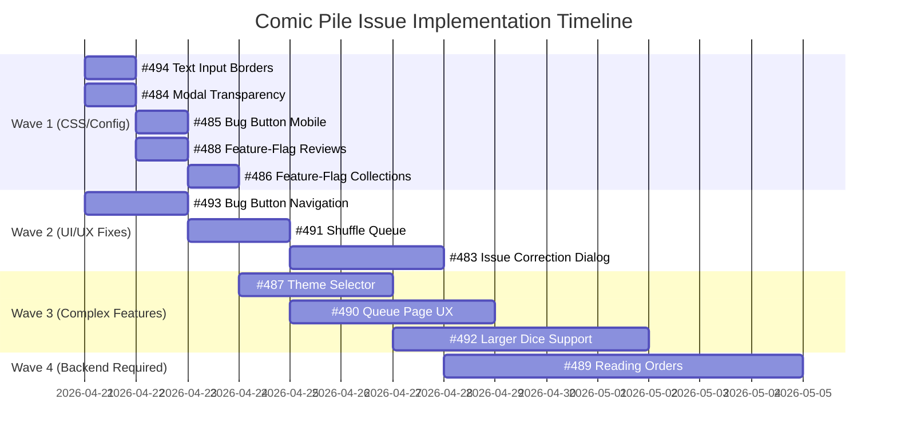

# Issue Implementation Gantt Chart

## Overview
This Gantt chart visualizes the implementation timeline for issues #483-#494 on JoshCLWren/comic-pile. Issues are grouped into waves based on complexity and dependencies.

## Wave Definitions

- **Wave 1 (1-2 days each)**: Quick CSS/config changes, fully independent
- **Wave 2 (2-3 days each)**: Moderate complexity, some UI/UX work
- **Wave 3 (3-5 days each)**: Complex UI with multiple features
- **Wave 4 (5+ days)**: Requires backend data model changes

## Wave Details

### Wave 1: Quick Wins (April 21-23)
| Issue | Title | Est. Time | Dependencies |
|-------|-------|-----------|--------------|
| #494 | Text Input Borders | 1 day | None |
| #484 | Modal Transparency | 1 day | None |
| #485 | Bug Button Mobile | 1 day | None |
| #488 | Feature-Flag Reviews | 1 day | None |
| #486 | Feature-Flag Collections | 1 day | None |

### Wave 2: UI/UX Fixes (April 21-27)
| Issue | Title | Est. Time | Dependencies |
|-------|-------|-----------|--------------|
| #493 | Bug Button Navigation | 2 days | None |
| #491 | Shuffle Queue | 2 days | Backend endpoint needed |
| #483 | Issue Correction Dialog | 3 days | None |

### Wave 3: Complex Features (April 24-May 1)
| Issue | Title | Est. Time | Dependencies |
|-------|-------|-----------|--------------|
| #487 | Theme Selector | 3 days | None |
| #490 | Queue Page UX | 4 days | None |
| #492 | Larger Dice | 5 days | 3D geometry for new dice |

### Wave 4: Backend Required (April 28-May 5)
| Issue | Title | Est. Time | Dependencies |
|-------|-------|-----------|--------------|
| #489 | Reading Orders | 7 days | New DB tables, API endpoints |

## Notes

- Wave 1 can run entirely in parallel - no shared files
- Wave 2 issues can overlap; #491 requires backend work first
- Wave 3 should start after Wave 1 to avoid CSS conflicts
- Wave 4 is the largest effort; consider starting backend early
- Total estimated timeline: ~10-12 working days with parallelization
